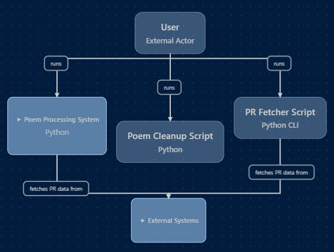
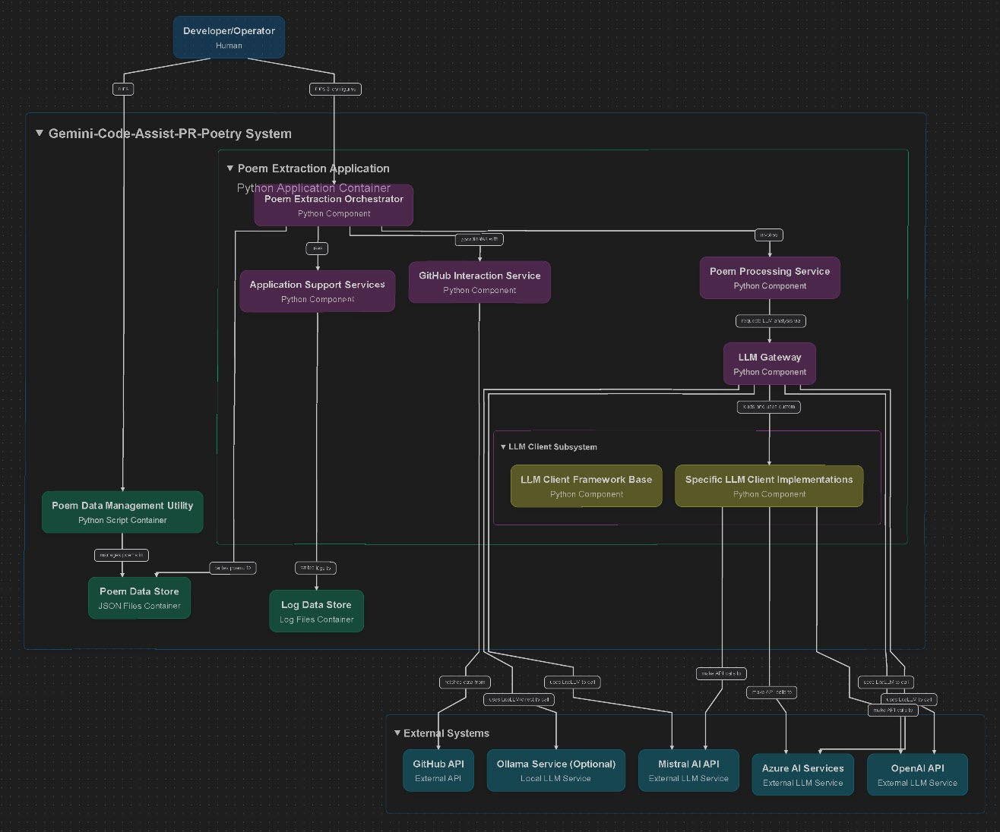

# Gemini Code Assist PR Poetry

[Listen to the Podcast Deep Dive
having a conversation about this project](https://youtu.be/XEh26jsH-2g?si=yVaqn5TcBZhUaVzZ)

## Why?

When a Pull Request is created, the **Gemini Code Assist** app analyzes it and generates a detailed report.
But tucked at the end of that report… a surprising flourish:

A snippet of poetry — inspired by the PR itself.

It took me off guard. For a moment I wondered:
**"This is a weird feature… why?"**

I know it's weird...
But maybe weird is good.
Maybe it's beautiful.

---

📖 A growing collection of these poetry nuggets lives in [`gem-flowers.md`](./gem-flowers.md) and [`gem-flowers.json`](./gem-flowers.json).

💻 I made a tool to automatically collect these gems from your GitHub repositories and any public repositories. Go try it out and start a collection of your own!

---


## 🌱 Contributing

Add your poetic PR discoveries to the collection and give a better home for these poetic snippets than their obscure Pull Request comments bottom lines. Give them some light and air.

I bet some gems will surface soon enough. ✨

### Automated Collection

You can use the provided scripts to automatically collect poems from GitHub repositories:

```bash
# Install dependencies
pip install requests gitpython tqdm litellm python-dotenv

# Set your GitHub token (will work without it but recommended to avoid rate limits)
# It's free to get one from https://github.com/marketplace/a
export GITHUB_TOKEN=your_github_token

# On Linux/macOS - use the run.sh script
./run.sh

# On Windows - use the run.bat script
run.bat

# Or run the Python script directly
python get_new_flowers.py

# Search for poems across multiple public repositories
python get_new_flowers.py --search --max-repos=10

# See all options
python get_new_flowers.py --help
```

### Configuration

The script can be configured using environment variables in a `.env` file:

```env
# Default LLM
GITHUB_TOKEN=your_github_token

# Fallback LLM
GEMINI_API_KEY=your_gemini_api_key

# Optional LiteLLM Logging (uncomment to enable)
# LITELLM_LOGGING=True
# LITELLM_LOG=DEBUG
```

### Key Features

- Collects poems from any public GitHub repository
- Adds new poems to the top of the file (LIFO order)
- Avoids duplicates
- Includes metadata about the source repository and PR
- Uses LLM models to identify poems in comments
- Automatically falls back to alternative models when rate limits are encountered
- Intelligently tracks failed models to avoid retrying them
- Logs detailed information about the collection process
- Supports multiple LLM providers (OpenAI, Azure, Gemini, Ollama, etc.)

### Output Formats

- **Markdown**: Human-readable format in `gem-flowers.md`
- **JSON**: Machine-readable format in `gem-flowers.json`

### Advanced Usage

```bash
# Specify a repository to check
python get_new_flowers.py --owner="username" --repo="repository"

# Limit the number of PRs to check
python get_new_flowers.py --max-prs=20

# Search across multiple repositories
python get_new_flowers.py --search --max-repos=10

# Run in interactive wizard mode
python get_new_flowers.py --wizard
# or use the short form
python get_new_flowers.py -w
```

### Wizard Mode

The script includes an interactive wizard mode that guides you through setting up the parameters:

- Run with `--wizard` or `-w` flag
- Displays default values in brackets [like this]
- Press Enter to use the default value or type a new value
- Provides a summary of your configuration before starting

See [CHANGELOG.md](./CHANGELOG.md) for version history and updates.

## Project Structure

- `get_new_flowers.py` - Main script for collecting poems
- `cleanup_poems.py` - Script for cleaning up the poem collection
- `run.sh` - Shell script to run collection and cleanup (Linux/macOS)
- `run.bat` - Batch script to run collection and cleanup (Windows)
- `gem-flowers.md` - Human-readable collection of poems
- `gem-flowers.json` - Machine-readable collection of poems
- `src/` - Core modules for the project
  - `config.py` - Configuration management
  - `error_handler.py` - Centralized error handling
  - `logger.py` - Logging system with file rotation
  - `llm_client_template.py` - Template for LLM clients
- `llm_client/` - LLM client implementations and configuration
- `logs/` - Log files with detailed information about collection runs
- `tests/` - Test scripts and utilities
- `utils/` - Utility scripts and tools
  - `PullPal` - Tool for fetching and saving complete PR conversations

---

 *It's like a gorgeous tiny flower growing on a big pile of snips*
 — `\x02\xM4\xNY\xC0\xFF\x55`

---

## Visual Overview - (Made with - CodeViz VSCode Extension)

  

---

  

---
