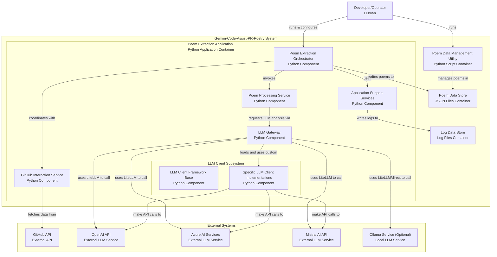

# System Context

## I am working on a software system with the following directory structure, architecture, and analyzed files:

## Directory Structure
```
Gemini-Code-Assist-PR-Poetry
├── docs
│   ├── drawio-diagrams
│   │   ├── overview-full.drawio
│   │   └── overview-min.drawio
│   ├── mermaid-diagrams
│   │   ├── diagram-rate-limiting.md
│   │   ├── diagram-sequences.md
│   │   ├── overview-full.md
│   │   └── overview-min.md
│   ├── podcast
│   │   └── DeepDive-Podcast-Gemini-Code-Assist-PR-Poetry-Collection.mp4
│   ├── post
│   │   └── dev.to.md
│   ├── reviews
│   │   ├── review-deepseek-v3.md
│   │   └── review-qwen3-235B.md
│   ├── tests-output
│   │   ├── terminal-log-all-fails-good-extration-gem-flowers.json
│   │   ├── terminal-log-all-fails-good-extration-gem-flowers.md
│   │   └── terminal-log-all-fails-good-extration.log
│   ├── cheatsheet.md
│   ├── context.md
│   ├── header.jpg
│   ├── output.jpg
│   ├── overview-basic.jpg
│   ├── overview-full.jpg
│   └── stats.jpg
├── llm_client
│   ├── custom_llm_model.json
│   ├── deepseek-v3-client.py
│   ├── gpt-4.1-github-client.py
│   ├── gpt-4o-client.py
│   ├── llama-3.1-8b-inst-client.py
│   ├── llama4-maverik-client.py
│   ├── mistral-large-client.py
│   ├── phi4-client.py
│   └── README.md
├── src
│   ├── __init__.py
│   ├── config.py
│   ├── error_handler.py
│   ├── llm_client_template.py
│   ├── logger.py
│   └── README.md
├── tests
│   ├── test_poem_extraction.py
│   └── test_script.py
├── utils
│   ├── PullPal-env-sample
│   ├── PullPal-gitignore
│   ├── PullPal-init.py
│   ├── PullPal-LICENSE
│   ├── PullPal-README.md
│   ├── PullPal-review.md
│   ├── PullPal-setup.py
│   └── PullPal.py
├── CHANGELOG.md
├── cleanup_poems.py
├── gem-flowers.json
├── gem-flowers.md
├── get_new_flowers.py
├── LICENSE
├── README.md
├── requirements.txt
├── run.bat
└── run.sh

```

## Mermaid Diagram


## Analyzed Files

