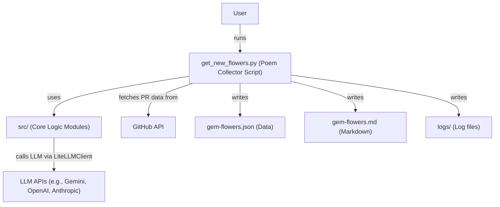

# System Context

## Current Directory Structure (Simplified)

```
Gemini-Code-Assist-PR-Poetry
├── docs
│   ├── drawio-diagrams
│   │   └── overview-min.drawio
│   ├── mermaid-diagrams
│   │   ├── diagram-rate-limiting.md
│   │   └── overview-min.md
│   ├── podcast
│   │   └── DeepDive-Podcast-Gemini-Code-Assist-PR-Poetry-Collection.mp4
│   ├── post
│   │   └── dev.to.md
│   ├── reviews
│   │   ├── review-deepseek-v3.md
│   │   └── review-qwen3-235B.md
│   ├── tests-output
│   │   ├── terminal-log-all-fails-good-extration-gem-flowers.json
│   │   ├── terminal-log-all-fails-good-extration-gem-flowers.md
│   │   └── terminal-log-all-fails-good-extration.log
│   ├── cheatsheet.md
│   ├── context.md
│   ├── header.jpg
│   ├── output.jpg
│   ├── overview-basic.jpg
│   └── stats.jpg
├── logs
│   └── collection_activity.log (example, actual name may vary if backups are created)
├── src
│   ├── __init__.py
│   ├── config.py
│   ├── error_handler.py
│   ├── llm_client_template.py
│   └── logger.py
├── tests
│   ├── test_llm_client_template.py
│   ├── test_poem_extraction.py
│   └── test_script.py
├── .env.example
├── .gitignore
├── CHANGELOG.md
├── gem-flowers.md
├── gem-flowers.json
├── get_new_flowers.py
├── LICENSE
├── README.md
├── requirements.txt
└── SECURITY.md
```

## Simplified System Diagram



## Overview

The system now centers around the `get_new_flowers.py` script. This script takes a GitHub repository URL and an LLM model name as input. It fetches pull request data from the specified repository, extracts comments, and uses the designated LLM (via LiteLLM, as implemented in `src/llm_client_template.py`) to identify and extract poems from these comments.

The collected poems are saved in `gem-flowers.json` and a human-readable Markdown version is generated in `gem-flowers.md`. Configuration primarily involves setting a `GITHUB_TOKEN` and any necessary API keys for the chosen LLM provider as environment variables (typically in a `.env` file). The `src/` directory contains modules for configuration (`config.py`), error handling (`error_handler.py`), logging (`logger.py`), and the LiteLLM client logic (`llm_client_template.py`).
The previous complex model fallback, search functionalities, and separate cleanup script have been removed to simplify the application.
