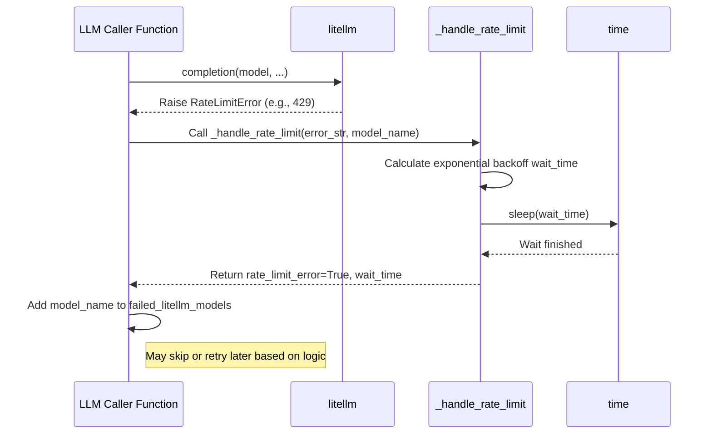

# Rate Limiting Diagram

```mermaid
sequenceDiagram
    participant Func as LLM Caller Function
    participant L as litellm
    participant H as _handle_rate_limit
    participant T as time

    Func->>L: completion(model, ...)
    L-->>Func: Raise RateLimitError (e.g., 429)
    Func->>H: Call _handle_rate_limit(error_str, model_name)
    H->>H: Calculate exponential backoff wait_time
    H->>T: sleep(wait_time)
    T-->>H: Wait finished
    H-->>Func: Return rate_limit_error=True, wait_time
    Func->>Func: Add model_name to failed_litellm_models
    Note right of Func: May skip or retry later based on logic
```
