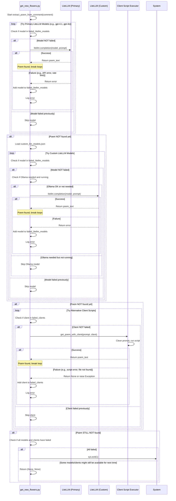

# Sequence Diagram for `extract_poem_from_comment(comment)`

```mermaid
sequenceDiagram
    participant Main as get_new_flowers.py
    participant L_Primary as LiteLLM (Primary)
    participant L_Custom as LiteLLM (Custom)
    participant Clients as Client Script Executor
    participant System

    Main->>Main: Start extract_poem_from_comment(comment)
    loop Try Primary LiteLLM Models (e.g., gpt-4.1, gpt-4o)
        Main->>Main: Check if model in failed_litellm_models
        alt Model NOT failed
            Main->>L_Primary: litellm.completion(model, prompt)
            alt Success
                L_Primary-->>Main: Return poem_text
                Note over Main: Poem found, break loops
            else Failure (e.g., API error, rate limit)
                L_Primary-->>Main: Return error
                Main->>Main: Add model to failed_litellm_models
                Main->>Main: Log error
            end
        else Model failed previously
             Main->>Main: Skip model
        end
    end

    alt Poem NOT found yet
        Main->>Main: Load custom_llm_models.json
        loop Try Custom LiteLLM Models
            Main->>Main: Check if model in failed_litellm_models
            alt Model NOT failed
                 Main->>Main: Check if Ollama needed and running
                 alt Ollama OK or not needed
                    Main->>L_Custom: litellm.completion(model, prompt)
                    alt Success
                        L_Custom-->>Main: Return poem_text
                        Note over Main: Poem found, break loops
                    else Failure
                        L_Custom-->>Main: Return error
                        Main->>Main: Add model to failed_litellm_models
                        Main->>Main: Log error
                    end
                else Ollama needed but not running
                    Main->>Main: Skip Ollama model
                end
            else Model failed previously
                 Main->>Main: Skip model
            end
        end
    end

    alt Poem NOT found yet
        loop Try Alternative Client Scripts
            Main->>Main: Check if client in failed_clients
            alt Client NOT failed
                Main->>Clients: get_poem_with_client(prompt, client)
                Clients->>Clients: Clean prompt, run script
                alt Success
                    Clients-->>Main: Return poem_text
                    Note over Main: Poem found, break loop
                else Failure (e.g., script error, file not found)
                    Clients-->>Main: Return None or raise Exception
                    Main->>Main: Add client to failed_clients
                    Main->>Main: Log error
                end
            else Client failed previously
                 Main->>Main: Skip client
            end
        end
    end

    alt Poem STILL NOT found
         Main->>Main: Check if all models and clients have failed
         alt All failed
            Main->>System: sys.exit(1)
         else Some models/clients might still be available for next time
            Main->>Main: Return (None, None)
         end
    end
```