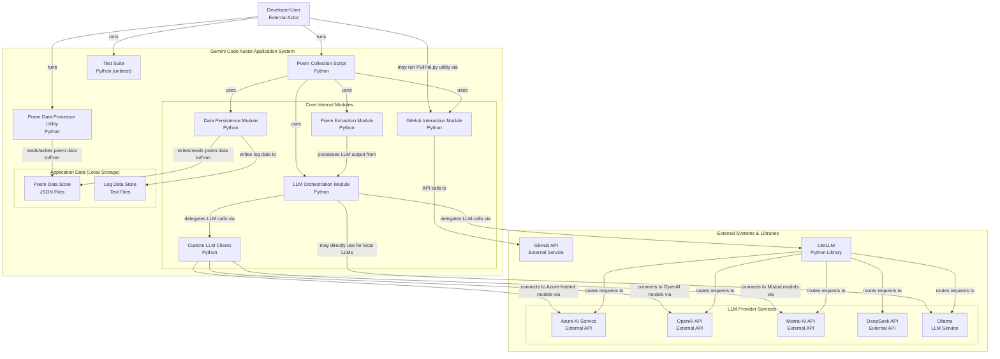

```mermaid
graph TD

    2561["Developer/User<br>External Actor"]
    subgraph 2556["External Systems & Libraries"]
        2572["GitHub API<br>External Service"]
        2573["LiteLLM<br>Python Library"]
        subgraph 2557["LLM Provider Services"]
            2574["Azure AI Service<br>External API"]
            2575["OpenAI API<br>External API"]
            2576["Mistral AI API<br>External API"]
            2577["DeepSeek API<br>External API"]
            2578["Ollama<br>LLM Service"]
        end
        %% Edges at this level (grouped by source)
        2573["LiteLLM<br>Python Library"] -->|routes requests to| 2574["Azure AI Service<br>External API"]
        2573["LiteLLM<br>Python Library"] -->|routes requests to| 2575["OpenAI API<br>External API"]
        2573["LiteLLM<br>Python Library"] -->|routes requests to| 2576["Mistral AI API<br>External API"]
        2573["LiteLLM<br>Python Library"] -->|routes requests to| 2577["DeepSeek API<br>External API"]
        2573["LiteLLM<br>Python Library"] -->|routes requests to| 2578["Ollama<br>LLM Service"]
    end
    subgraph 2558["Gemini Code Assist Application System"]
        2562["Poem Collection Script<br>Python"]
        2563["Poem Data Processor Utility<br>Python"]
        2571["Test Suite<br>Python (unittest)"]
        subgraph 2559["Application Data (Local Storage)"]
            2569["Poem Data Store<br>JSON Files"]
            2570["Log Data Store<br>Text Files"]
        end
        subgraph 2560["Core Internal Modules"]
            2564["GitHub Interaction Module<br>Python"]
            2565["LLM Orchestration Module<br>Python"]
            2566["Custom LLM Clients<br>Python"]
            2567["Poem Extraction Module<br>Python"]
            2568["Data Persistence Module<br>Python"]
            %% Edges at this level (grouped by source)
            2567["Poem Extraction Module<br>Python"] -->|processes LLM output from| 2565["LLM Orchestration Module<br>Python"]
            2565["LLM Orchestration Module<br>Python"] -->|delegates LLM calls via| 2566["Custom LLM Clients<br>Python"]
        end
        %% Edges at this level (grouped by source)
        2563["Poem Data Processor Utility<br>Python"] -->|reads/writes poem data to/from| 2569["Poem Data Store<br>JSON Files"]
        2562["Poem Collection Script<br>Python"] -->|uses| 2564["GitHub Interaction Module<br>Python"]
        2562["Poem Collection Script<br>Python"] -->|uses| 2565["LLM Orchestration Module<br>Python"]
        2562["Poem Collection Script<br>Python"] -->|uses| 2567["Poem Extraction Module<br>Python"]
        2562["Poem Collection Script<br>Python"] -->|uses| 2568["Data Persistence Module<br>Python"]
        2568["Data Persistence Module<br>Python"] -->|writes/reads poem data to/from| 2569["Poem Data Store<br>JSON Files"]
        2568["Data Persistence Module<br>Python"] -->|writes log data to| 2570["Log Data Store<br>Text Files"]
    end
    %% Edges at this level (grouped by source)
    2561["Developer/User<br>External Actor"] -->|runs| 2562["Poem Collection Script<br>Python"]
    2561["Developer/User<br>External Actor"] -->|runs| 2563["Poem Data Processor Utility<br>Python"]
    2561["Developer/User<br>External Actor"] -->|may run PullPal.py utility via| 2564["GitHub Interaction Module<br>Python"]
    2561["Developer/User<br>External Actor"] -->|runs| 2571["Test Suite<br>Python (unittest)"]
    2565["LLM Orchestration Module<br>Python"] -->|may directly use for local LLMs| 2578["Ollama<br>LLM Service"]
    2565["LLM Orchestration Module<br>Python"] -->|delegates LLM calls via| 2573["LiteLLM<br>Python Library"]
    2564["GitHub Interaction Module<br>Python"] -->|API calls to| 2572["GitHub API<br>External Service"]
    2566["Custom LLM Clients<br>Python"] -->|connects to Azure-hosted models via| 2574["Azure AI Service<br>External API"]
    2566["Custom LLM Clients<br>Python"] -->|connects to OpenAI models via| 2575["OpenAI API<br>External API"]
    2566["Custom LLM Clients<br>Python"] -->|connects to Mistral models via| 2576["Mistral AI API<br>External API"]
```
