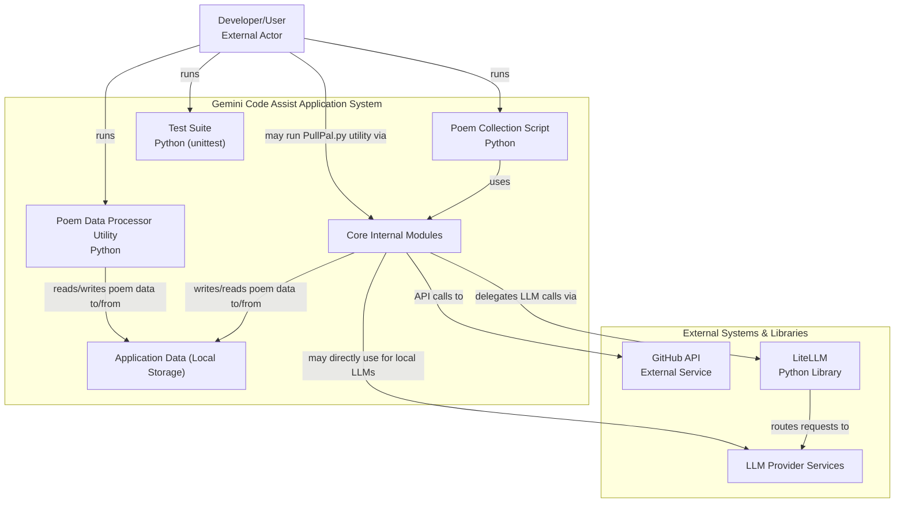

```mermaid
graph TD

    2561["Developer/User<br>External Actor"]
    subgraph 2556["External Systems & Libraries"]
        2557["LLM Provider Services"]
        2572["GitHub API<br>External Service"]
        2573["LiteLLM<br>Python Library"]
        %% Edges at this level (grouped by source)
        2573["LiteLLM<br>Python Library"] -->|routes requests to| 2557["LLM Provider Services"]
    end
    subgraph 2558["Gemini Code Assist Application System"]
        2559["Application Data (Local Storage)"]
        2560["Core Internal Modules"]
        2562["Poem Collection Script<br>Python"]
        2563["Poem Data Processor Utility<br>Python"]
        2571["Test Suite<br>Python (unittest)"]
        %% Edges at this level (grouped by source)
        2560["Core Internal Modules"] -->|writes/reads poem data to/from| 2559["Application Data (Local Storage)"]
        2563["Poem Data Processor Utility<br>Python"] -->|reads/writes poem data to/from| 2559["Application Data (Local Storage)"]
        2562["Poem Collection Script<br>Python"] -->|uses| 2560["Core Internal Modules"]
    end
    %% Edges at this level (grouped by source)
    2561["Developer/User<br>External Actor"] -->|runs| 2562["Poem Collection Script<br>Python"]
    2561["Developer/User<br>External Actor"] -->|runs| 2563["Poem Data Processor Utility<br>Python"]
    2561["Developer/User<br>External Actor"] -->|runs| 2571["Test Suite<br>Python (unittest)"]
    2561["Developer/User<br>External Actor"] -->|may run PullPal.py utility via| 2560["Core Internal Modules"]
    2560["Core Internal Modules"] -->|may directly use for local LLMs| 2557["LLM Provider Services"]
    2560["Core Internal Modules"] -->|API calls to| 2572["GitHub API<br>External Service"]
    2560["Core Internal Modules"] -->|delegates LLM calls via| 2573["LiteLLM<br>Python Library"]
```