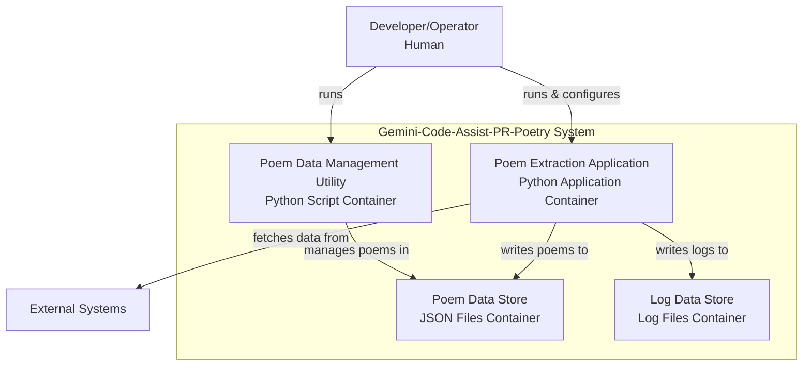

```mermaid
graph TD

    1007["External Systems"]
    1011["Developer/Operator<br>Human"]
    subgraph 1008["Gemini-Code-Assist-PR-Poetry System"]
        1009["Poem Extraction Application<br>Python Application Container"]
        1019["Poem Data Store<br>JSON Files Container"]
        1020["Log Data Store<br>Log Files Container"]
        1021["Poem Data Management Utility<br>Python Script Container"]
        %% Edges at this level (grouped by source)
        1021["Poem Data Management Utility<br>Python Script Container"] -->|manages poems in| 1019["Poem Data Store<br>JSON Files Container"]
        1009["Poem Extraction Application<br>Python Application Container"] -->|writes poems to| 1019["Poem Data Store<br>JSON Files Container"]
        1009["Poem Extraction Application<br>Python Application Container"] -->|writes logs to| 1020["Log Data Store<br>Log Files Container"]
    end
    %% Edges at this level (grouped by source)
    1011["Developer/Operator<br>Human"] -->|runs & configures| 1009["Poem Extraction Application<br>Python Application Container"]
    1011["Developer/Operator<br>Human"] -->|runs| 1021["Poem Data Management Utility<br>Python Script Container"]
    1009["Poem Extraction Application<br>Python Application Container"] -->|fetches data from| 1007["External Systems"]
```